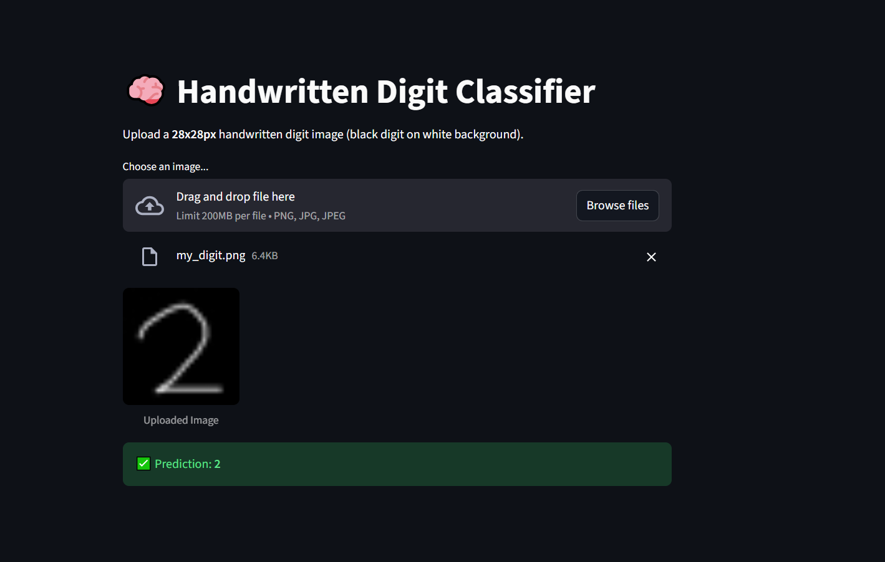

# MNIST Digit Classification with Streamlit 🔢 ✨

## Overview 🎯
A deep learning project using TensorFlow/PyTorch to classify MNIST handwritten digits with >95% accuracy, visualized through a Streamlit web app.

## Project Goals 🎯
- 🚀 Train CNN model for MNIST digit classification
- ✅ Achieve >95% test accuracy
- 🌐 Deploy interactive Streamlit visualization
- 🔍 Demonstrate model predictions on sample images

## Results 📊
- 🎯 Target Accuracy: 95%
- ⭐ Achieved Accuracy: 97.64%
- 👁️ Visual verification through sample predictions

## Live Demo 🌐
Try the app: [MNIST Classifier](https://handwritedigitclassifier.streamlit.app/)

## App Preview 📱



## Setup ⚙️
```bash
# 1. Clone the repository
git clone https://github.com/grey-hat-piper/streamlit_app.git
cd streamlit_app

# 2. Create a virtual environment
python -m venv venv
source venv/bin/activate  # On Windows: venv\Scripts\activate

# 3. Install dependencies
pip install -r requirements.txt

# 4. Train the model
python mnist_model.py

# 5. Launch the Streamlit app
streamlit run app.py
```

## Technical Details 🛠️
- 🧠 Model: CNN architecture
- 📸 Input: 28x28 grayscale images
- 📉 Loss: Categorical Crossentropy
- ⚡ Optimizer: Adam
- 📊 Output: 10-class softmax

## Visualization 📈
Streamlit app displays:
- 🔄 Real-time predictions
- 🖼️ 5 sample test images
- 📊 Confidence scores
- 🎮 Interactive interface

## Ethical Considerations 🤝
- 🎯 Dataset bias awareness
- ⚖️ Model fairness assessment
- 📊 Performance consistency monitoring
- 🔍 TensorFlow Fairness Indicators integration


